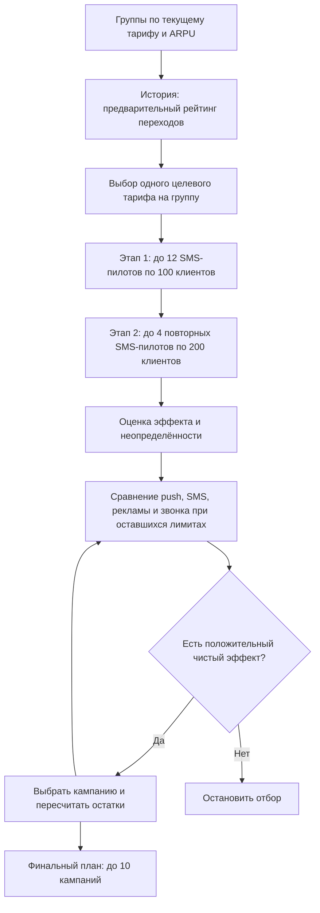

# Enrique-agent

## Задача

Агент выбирает сегменты клиентов, целевые тарифы и каналы связи для кампаний по смене тарифа. Он проверяет гипотезы на пилотах и формирует план, который должен увеличить ARPU за вычетом расходов на коммуникацию.

> Данные и тарифы в кейсе синтетические. Результаты локальной проверки не являются прогнозом результата на судействе: там используется другая модель эффектов.

## Гипотеза и её проверка

Мы предполагаем, что для группы с определённым текущим тарифом и уровнем ARPU другой тариф может увеличить выручку. Исторические переходы помогают выбрать, какую идею проверить первой. Они относятся к другой аудитории и не доказывают, что конкретный человек согласится на предложение. Проверка гипотезы — пилот на текущих абонентах.


Например, переход `tariff_4 → tariff_8` выглядит осмысленным кандидатом: пакет интернета увеличивается с 4 до 8 ГБ, пакет минут — с 40 до 80. Это объясняет, почему предложение стоит проверить, но не гарантирует переход. Текущая версия агента формирует кандидатов по тарифу, ARPU-сегменту и истории; потребление интернета и звонков пока не участвует в выборе.

## Как работает агент

Основная реализация находится в `archive/agent.py` и соответствует интерфейсу `Agent.act(env)`.

1. Группирует аудиторию по текущему тарифу и ARPU-сегменту (`LOW`, `MID`, `HIGH`). Для каждой группы считает охват и средний `predicted_arpu`.
2. Использует историю смен тарифов из `archive/data/change_tariff.csv` как слабую подсказку для выбора гипотез. Историческая выборка отличается от целевой.
3. Проводит первый этап проверки: до 12 SMS-пилотов по 100 клиентов для широкого отбора гипотез. Затем повторно проверяет до 4 наиболее перспективных или неоднозначных гипотез SMS-пилотами по 200 клиентов. Пилоты расходуют общий бюджет и лимит контактов.
4. Совмещает историческую оценку с шумными результатами пилотов с учётом их размера и неопределённости. Для каждого канала сравнивает ожидаемый и осторожный чистый эффект при фактически доступном бюджете и охвате; повторные контакты не считает новым охватом.
5. Последовательно выбирает до 10 финальных кампаний и после каждого выбора пересчитывает доступные бюджет, контакты и варианты каналов.



Чистый результат скорера равен сумме прироста ARPU по уникальным клиентам за вычетом стоимости **всех** контактов, включая пилоты и повторные контакты. Пилот даёт шумный результат для группы, а не вероятность перехода каждого отдельного абонента.

Это статистический агент с последовательным выбором гипотез; отдельная нейросеть или внешний LLM не используются. Эффект и итоговый балл рассчитываются предоставленной средой и скорером.

## Откуда берётся чистый результат

Скорер считает **модельный прирост ARPU**, а не фактически полученные платежи. В локальной мок-модели для каждого затронутого абонента расчёт такой:

```text
Эффект клиента = predicted_arpu
               × среднее относительное изменение ARPU при переходе
               × min(1, доля исторических переходов × множитель канала)

Чистый результат = сумма лучших эффектов по уникальным абонентам
                 − стоимость всех контактов, включая пилоты
```

Например, на `seed=42` одна финальная кампания предлагает группе `tariff_4 / MID` перейти на `tariff_8` через `digital_ads`. Она охватывает **1 227 человек** со средним `predicted_arpu` около **4 760 у.е.** Для этой пары тарифов мок-модель использует среднее изменение ARPU **39,45%**, долю исторических переходов **60,90%** и множитель рекламы **0,85**:

```text
4 760 × 39,45% × 60,90% × 0,85 ≈ 972 у.е. на человека
972 × 1 227 ≈ 1 192 642 у.е. валового прироста кампании
1 192 642 − (1 227 × 22) ≈ 1 165 648 у.е. после её расходов
```

Последняя строка показывает эффект кампании **отдельно от остальных**. При сложении всех кампаний и пилотов валовый прирост до устранения повторов составляет примерно **4 294 715 у.е.** Из него скорер убирает около **729 100 у.е.** повторно посчитанного эффекта: один абонент учитывается только по лучшей для него кампании. После вычета **99 998 у.е.** затрат на все контакты получается **3 465 618 у.е.** чистого прироста (точное вычисление выполняется до округления показанных чисел).

Доля исторических переходов в мок-модели **не является измеренной вероятностью согласия на рекламу**. Именно поэтому высокий локальный результат нельзя переносить на реальных клиентов или скрытую модель судейства.

## Состав проекта

- `archive/agent.py` — агент, который запускается и сдаётся.
- `archive/agent_template.py` — исходный демонстрационный шаблон.
- `archive/environment.py`, `archive/mock_environment.py` — интерфейс пилотов и локальная имитация среды.
- `archive/scoring_core.py` — проверка кампаний, применение лимитов и расчёт чистого результата.
- `archive/local_eval.py` — локальная оценка агента.
- `archive/make_submission.py` — генератор `submission.csv` с фиксированным seed.
- `archive/customer_profile.csv` — профиль целевой аудитории.
- `archive/data/` — история тарифов, месячный ARPU, трафик и машинный справочник тарифов.
- `archive/tariff_dictionary.csv`, `archive/feature_dictionary.csv` — справочники для чтения человеком.
- `archive/PARTICIPANT_GUIDE.md` и `.pdf` — полное задание и правила кейса.

## Запуск и воспроизведение

Нужен Python и библиотеки `pandas`, `numpy`. Все команды выполняются из папки `archive/`, так как скрипты используют относительные пути:

```bash
cd archive
python -m pip install pandas numpy
python local_eval.py
python local_eval.py --runs 10
python make_submission.py
```

`local_eval.py` без аргументов запускает seed 42. Режим `--runs 10` запускает seed 0–9 и показывает устойчивость на разных случайных результатах пилотов. `make_submission.py` создаёт `submission.csv`; повторный запуск с тем же кодом и seed воспроизводит тот же план.

## Результаты локальных прогонов

Проверено на мок-модели кейса с текущим `archive/agent.py`:

- seed 42: статус **PASS**, чистый результат **+3 465 618 у.е.** (+2,301% к baseline); валовый прирост **3 565 616 у.е.**, стоимость контактов **99 998 у.е.**
- На seed 42 проведено **16 пилотов** (12 по 100 и 4 по 200 клиентов) и сформировано **8 финальных кампаний**. Всего скорер учёл **8 321 контакт** с **6 747 уникальными абонентами**. Число «24 кампании» в отчёте скорера включает 16 пилотов и 8 финальных кампаний; ограничение в 10 относится к финальному плану.
- Финальный план seed 42 использует 2 кампании `digital_ads`, 1 `call`, 1 `sms` и 4 `push`. Их сегменты, тарифы и каналы записаны в `archive/submission.csv`.
- seed 0–9: положительный результат в **10 из 10** прогонов; медиана **+3 533 049 у.е.**, диапазон **+2 586 971…+3 683 688 у.е.** Меньшее значение на seed 6 показывает чувствительность выбора дорогого канала к шуму пилотов.

Это результаты локальной мок-модели, а не прогноз прибыли или балла на судействе.

## Ограничения и дальнейшая работа

- Скрытые эффекты на судействе отличаются от мок-модели; локальный результат проверяет механику и поведение агента, но не будущий балл.
- Текущие кампании сегментируют по текущему тарифу и ARPU. Признаки потребления интернета и звонков доступны в профиле, но пока не входят в фильтры финального плана.
- Пилот возвращает агрегированную шумную оценку, а не индивидуальные результаты, поэтому доверительная оценка приближённая; полноценный bootstrap по клиентам недоступен.
- Исторические переходы — не рандомизированные отклики на маркетинговое предложение, поэтому используются только для приоритизации пилотов.
- Следующие улучшения: сравнить стратегии на одинаковых seed, добавить сегментацию по потреблению и проверить устойчивость распределения бюджета между дорогими каналами при неудачных пилотах.

Перед сдачей сверьте ограничения и формат артефактов с `archive/PARTICIPANT_GUIDE.md`.
## Графическое демо
Установите зависимости из корня репозитория и запустите интерфейс:
```bash
python -m pip install -r requirements.txt
streamlit run app.py
```
Интерфейс запускает `Agent.act(env)` на локальной мок-среде и показывает пилоты, итоговый план, затраты и чистый результат. Мок-модель нужна для проверки механики и отличается от скрытой модели судейства.

