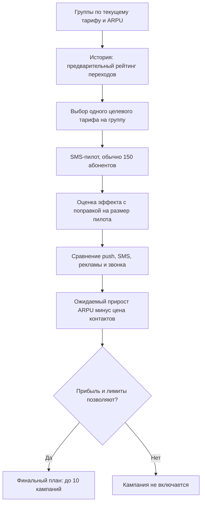

# Enrique-agent

## Задача

Агент выбирает сегменты клиентов, целевые тарифы и каналы связи для кампаний по смене тарифа. Он проверяет гипотезы на пилотах и формирует план, который должен увеличить ARPU за вычетом расходов на коммуникацию.

> Данные и тарифы в кейсе синтетические. Результаты локальной проверки не являются прогнозом результата на судействе: там используется другая модель эффектов.

## Гипотеза и её проверка

Мы предполагаем, что для группы с определённым текущим тарифом и уровнем ARPU другой тариф может увеличить выручку. Исторические переходы помогают выбрать, какую идею проверить первой. Они относятся к другой аудитории и не доказывают, что конкретный человек согласится на предложение. Проверка гипотезы — пилот на текущих абонентах.


Например, переход `tariff_4 → tariff_8` выглядит осмысленным кандидатом: пакет интернета увеличивается с 4 до 8 ГБ, пакет минут — с 40 до 80. Это объясняет, почему предложение стоит проверить, но не гарантирует переход. Текущая версия агента формирует кандидатов по тарифу, ARPU-сегменту и истории; потребление интернета и звонков пока не участвует в выборе.

## Как работает агент

Основная реализация находится в `archive/agent.py` и соответствует интерфейсу `Agent.act(env)`.

1. Группирует аудиторию по текущему тарифу и ARPU-сегменту (`LOW`, `MID`, `HIGH`). Для каждой группы считает охват и средний `predicted_arpu`.
2. Использует историю смен тарифов из `archive/data/change_tariff.csv` как слабую подсказку для выбора гипотез. Историческая выборка отличается от целевой.
3. Проверяет отобранные сочетания пилотами через `env.run_pilot`, обычно до 150 клиентов в пилоте через SMS. Пилоты расходуют общий бюджет и лимит контактов.
4. Обновляет оценку эффекта с учётом шума и размера пилота, затем оценивает варианты каналов с учётом их стоимости и доступных лимитов.
5. Возвращает до 10 кампаний с фильтрами аудитории, целевым тарифом и каналом.



Чистый результат скорера равен сумме прироста ARPU по уникальным клиентам за вычетом стоимости **всех** контактов, включая пилоты и повторные контакты. Пилот даёт шумный результат для группы, а не вероятность перехода каждого отдельного абонента.

Это статистический агент с последовательным выбором гипотез; отдельная нейросеть или внешний LLM не используются. Эффект и итоговый балл рассчитываются предоставленной средой и скорером.

## Состав проекта

- `archive/agent.py` — агент, который запускается и сдаётся.
- `archive/agent_template.py` — исходный демонстрационный шаблон.
- `archive/environment.py`, `archive/mock_environment.py` — интерфейс пилотов и локальная имитация среды.
- `archive/scoring_core.py` — проверка кампаний, применение лимитов и расчёт чистого результата.
- `archive/local_eval.py` — локальная оценка агента.
- `archive/make_submission.py` — генератор `submission.csv` с фиксированным seed.
- `archive/customer_profile.csv` — профиль целевой аудитории.
- `archive/data/` — история тарифов, месячный ARPU, трафик и машинный справочник тарифов.
- `archive/tariff_dictionary.csv`, `archive/feature_dictionary.csv` — справочники для чтения человеком.
- `archive/PARTICIPANT_GUIDE.md` и `.pdf` — полное задание и правила кейса.

## Запуск и воспроизведение

Нужен Python и библиотеки `pandas`, `numpy`. Все команды выполняются из папки `archive/`, так как скрипты используют относительные пути:

```bash
cd archive
python -m pip install pandas numpy
python local_eval.py
python local_eval.py --runs 10
python make_submission.py
```

`local_eval.py` без аргументов запускает seed 42. Режим `--runs 10` запускает seed 0–9 и показывает устойчивость на разных случайных результатах пилотов. `make_submission.py` создаёт `submission.csv`; повторный запуск с тем же кодом и seed воспроизводит тот же план.

## Результаты локальных прогонов

Проверено на мок-модели кейса:

- seed 42: **+1 257 135 у.е.** чистого результата; 15 пилотов; 2 818 контактов всего.
- seed 20–69: положительный результат в **50 из 50** прогонов; медиана **+1 250 113 у.е.**, среднее **+1 165 658 у.е.**, диапазон **+524 049…+1 317 220 у.е.**.
- В этих проверках финальный план выбирал звонок сегменту `tariff_4 / MID` с предложением `tariff_8`. Это поведение конкретной мок-модели, а не обещание такой же кампании или прибыли на судействе.

## Ограничения и дальнейшая работа

- Скрытые эффекты на судействе отличаются от мок-модели; локальный результат проверяет механику и поведение агента, но не будущий балл.
- Текущая кампания сегментирует по текущему тарифу и ARPU. Признаки потребления интернета и звонков доступны в профиле, но пока не входят в фильтры финального плана.
- Пилот возвращает агрегированную шумную оценку, а не индивидуальные результаты, поэтому доверительная оценка приближённая; полноценный bootstrap по клиентам недоступен.
- Исторические переходы — не рандомизированные отклики на маркетинговое предложение, поэтому используются только для приоритизации пилотов.
- Следующие улучшения: сравнить стратегии на одинаковых seed, добавить сегментацию по потреблению и проверить, можно ли снизить концентрацию бюджета в одной кампании без потери ожидаемой прибыли.

Перед сдачей сверьте ограничения и формат артефактов с `archive/PARTICIPANT_GUIDE.md`.
## Графическое демо
Установите зависимости из корня репозитория и запустите интерфейс:
```bash
python -m pip install -r requirements.txt
streamlit run app.py
```
Интерфейс запускает `Agent.act(env)` на локальной мок-среде и показывает пилоты, итоговый план, затраты и чистый результат. Мок-модель нужна для проверки механики и отличается от скрытой модели судейства.
